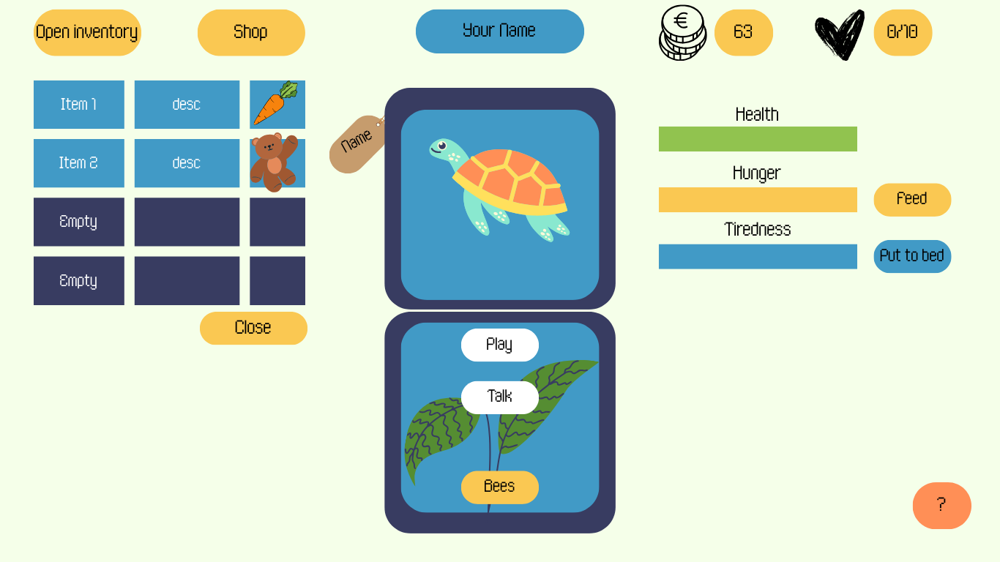

# Tamagochi game :
A browser-based virtual pet game made with native JavaScript, HTML, and CSS.

Notes : This is a simple implementation and will be improved with more features and better design. The current design is static and it is recommended to be on full screen on a computer browser.

## How to play :
    Note : There is also a tutorial button in the game.
- Take care of your virtual pet by managing three vital stats:
  - **Health** (Green meter)
  - **Hunger** (Yellow meter)
  - **Sleep** (Blue meter)
- Feed your pet using the `Feed` button (costs 5 coins)
- Put your pet to sleep using the `Sleep` button. It pauses the other meters decay.
- Play the `Head or Tails` mini-game to earn coins
- Keep your pet alive by maintaining its stats above zero

### Mini-Game: Head or Tails
- Click `Play` to start the mini-game
- Choose either "Head" or "Tails"
- You win 10 coins for correct guesses
- Use coins to feed your pet

## CSS :
- The color palette is made from 8 colors :
  - `#001514`, Rich black
  - `#f5ffe9`, White
  - `#419ac6`, Celestial blue
  - `#2e8cbb`, Darker blue
  - `#383c61`, Deep blue
  - `#81f781`, Bright green
  - `#FAC852`, Light yellow
  - `#eab53a`, Darker yellow

## 🔧 Technical Details

### Core Game Mechanics

#### Stats Management
- Each stat (health, hunger, sleep) has a maximum value of 30
- Stats decrease over time at different intervals:
  - Health: Decreases when hunger is below 50%
  - Hunger: Decreases every second
  - Sleep: Decreases every 3 seconds

#### Pet States
The pet has different visual states shown through SVG images:
- `creaturenutre.svg` - Normal state
- `creatureohno.svg` - Hungry state
- `creaturezzz.svg` - Sleeping state
- `creatureded.svg` - Death state

#### Key Functions

- `game()`: Main game loop and initialization
- `updateMeters()`: Updates the visual display of stat meters
- `loseH(), loseF(), loseS()`: Decrease respective stats in intervals and certain conditions
- `sleep()`: Manages sleep mechanics and recovery
- `PileOuFace()`: Random number generator for a mini-game
- `updateWallet()`: Updates coin display
- `initGame()`: Initializes the game after choosing a name

### Economy System
- Start with 0 coins
- Win coins through the Head or Tails mini-game
- Feeding costs 5 coins

### Death Conditions
- Health reaches 0
- Game over message appears
- Refresh page to restart

## 🛠️ Implementation Notes
- Interval-based stat reduction
- Uses event listeners for button interactions
- Manages game state through boolean flags
- Features a simple economy system
- Has remnants of a kill btn and console.logs for debugging

### Future Improvements
- Add more mini-games for coin earning
- Add option for chatting with the pet (pre-recorded responses)
- Include more pet states and animations
- Inventory with foods and toys
- Implement more complex pet care mechanics (ex. grooming, attachment)
- Add a save/load feature to retain pet stats and coins
- Implement different color palettes
- Implement sound effects

### Original plan

### Plan with more ideas
